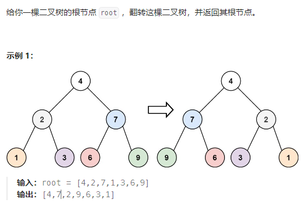

<!--
 * @Description:
 * @author: kelly
 * @Date: 2024-01-14 16:00:58
 * @LastEditTime: 2024-01-14 16:53:21
-->

## [翻转二叉树](https://leetcode.cn/problems/invert-binary-tree/description/)



翻转二叉树，其实就是将二叉树的左右节点对调，即可实现二叉树的整体翻转。

这里其实可以采用前序遍历（根左右）和后序遍历（左右根），递归方式可以，那么利用迭代（栈）依旧是可以实现的。
不仅如此，还可以采用层次遍历的解法。

唯独中序遍历（左根右）就实现起来比较麻烦一点。

1. 接下来，我们先用递归结合交换左右节点的定义来实现一下：

```js
/**
 * Definition for a binary tree node.
 * function TreeNode(val, left, right) {
 *     this.val = (val===undefined ? 0 : val)
 *     this.left = (left===undefined ? null : left)
 *     this.right = (right===undefined ? null : right)
 * }
 */
/**
 * @param {TreeNode} root
 * @return {TreeNode}
 */
var invertTree = function (root) {
  if (!root) return root;
  let temp = root.right;
  root.right = root.left;
  root.left = temp;
  invertTree(root.left);
  invertTree(root.right);
  return root;
};
```

2. 使用**前序遍历**的迭代方式实现：

**栈：**

```js
var invertTree = function (root) {
  // 定义节点交换函数
  const invertNode = function (root, left, right) {
    let temp = left;
    left = right;
    right = temp;
    root.left = left;
    root.right = right;
  };

  // 使用迭代方法的前序遍历
  let stack = [];
  if (root === null) {
    return root;
  }
  stack.push(root);
  while (stack.length) {
    let cur = stack.pop();
    if (cur !== null) {
      // 前序遍历（根左右），那么入栈顺序就是右左根
      cur.right && stack.push(cur.right);
      cur.left && stack.push(cur.left);
      stack.push(cur);
      stack.push(null);
    } else {
      cur = stack.pop();
      invertNode(cur, cur.left, cur.right);
    }
  }
  return root;
};
```

3. 使用层次遍历的迭代方式来实现：

**队列：**

```js
var invertTree = function (root) {
  // 定义节点交换函数
  const invertNode = function (root, left, right) {
    let temp = left;
    left = right;
    right = temp;
    root.left = left;
    root.right = right;
  };

  // 使用迭代方法的层次遍历
  let queue = [];
  if (root === null) {
    return root;
  }
  queue.push(root);
  while (queue.length) {
    let length = queue.length;
    while (length--) {
      let cur = queue.shift();
      // 节点处理逻辑
      invertNode(cur, cur.left, cur.right);
      cur.left && queue.push(cur.left);
      cur.right && queue.push(cur.right);
    }
  }
  return root;
};
```
